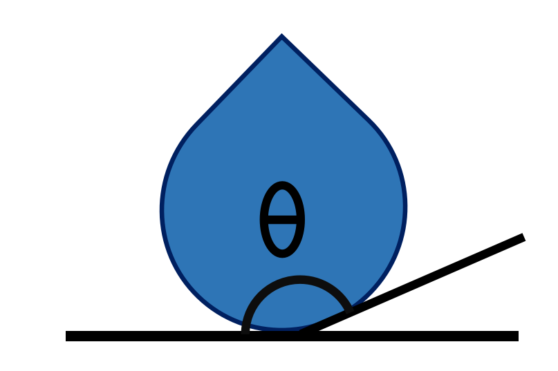

Introduction
============

**HydroAngleAnalyzer** is a Python package designed to analyze the contact angle of droplets from molecular dynamics simulations. It provides a modular workflow to parse trajectories, compute contact angles using different theoretical methods, and visualize the results.

Package Overview
----------------

The package operates in three main stages: **Parsing**, **Calculation**, and **Visualization**.

.. mermaid::

   graph LR
      A[Trajectory Parser] --> B[Contact Angle Calculation]
      B --> C[Visualization]

      subgraph Parsing
      A
      end

      subgraph Methods
      B
      end

      subgraph Output
      C
      end

1. Trajectory Parser
--------------------

The first step is to import the simulation trajectory. HydroAngleAnalyzer supports common formats used in molecular dynamics:

.. list-table::
   :widths: 20 80
   :header-rows: 0
   :class: borderless

   * - .. image:: ../../images/Lammps-logo.png
          :width: 100
          :align: center
     - **LAMMPS**: The package can parse ``.lammpstrj`` files natively, handling periodic boundaries and extracting specific atom types (e.g., liquid vs. solid).
   * - .. image:: ../../images/ase256.png
          :width: 80
          :align: center
     - **ASE**: Support for the **Atomic Simulation Environment (ASE)** allows reading a wide range of trajectory formats beyond LAMMPS.

The parser identifies the coordinate system (x, y, z) and separates the atoms of interest (e.g., water molecules) from the substrate/wall.

2. Contact Angle Calculation
----------------------------

Once the trajectory is parsed, the core analysis is performed. Two main theoretical methods are available:

**Supported Geometries**
^^^^^^^^^^^^^^^^^^^^^^^^

Both methods are capable of analyzing:

*   **Spherical Droplets**: Standard spherical cap shapes.
*   **Cylindrical Droplets**: Cylindrical droplets (e.g., water on a nanowire or with periodic boundary conditions), analyzed along the cylinder's axis (x or y).

**Sliced Method**
^^^^^^^^^^^^^^^^^

The **Sliced Method** is ideal for analyzing the evolution of the contact angle over time or for symmetric droplets.

*   **Theory**: The droplet is divided into vertical slices along the z-axis.
*   **Process**: For each slice, the liquid-vapor interface is determined. A geometric model (such as a sphere or cylinder) is then fitted to these interface points.
*   **Application**: Best for spherical droplets or specific 2D projections where a clear profile can be mathematically fitted.

To accurately define the liquid-vapor interface of the droplet, we employ a vertical slicing strategy along the z-axis. First, a definition of a 2D slicing plane passing through the droplet's geometric center is determined by an azimuthal angle.

Within this plane, we identify the interface coordinates by scanning radially from the geometric center. For a given axis (defined by an altitudinal angle), the local density is measured at discrete intervals.
A function is then fitted to this density profile to locate the sharp drop in density that marks the limit between the liquid and vapor phases. This operation is repeated across a range of altitudinal angles to generate a cloud of points representing the droplet’s profile on that plane.

To calculate the contact angle, points near the substrate are first excluded to avoid boundary effects. A circle is then fitted to the remaining interface points, and the contact angle is derived from the intersection of this circle with the bottom of the droplet (the substrate).
Finally, the entire procedure is repeated for multiple azimuthal angles (rotating the slicing plane). This yields a distribution of contact angles, from which a mean contact angle is computed.

**Binning Method**
^^^^^^^^^^^^^^^^^^

.. warning::
    For the binning method, it is crucial that the droplet remains centered in the simulation box. We recommend using a recentering command during the simulation, such as:

    ``fix recenter group_id INIT INIT NULL``

The **Binning Method** uses a spatial discretization approach, suitable for averaging over multiple frames to get a smooth density profile.

*   **Theory**: The simulation box is divided into a grid (bins) in the plane of interest (e.g., x-z).
*   **Process**: The local density of liquid particles is calculated for each bin. The interface is defined by the isodensity contour (where density drops to half the bulk value). The contact angle is derived from the tangent of this contour at the solid surface.
*   **Application**: Robust for irregular shapes or when high statistical averaging is needed.

3. Visualization
----------------

Finally, the results are visualized to validate the analysis.

*   **Profile Plots**: View the fitted geometric shape (circle, ellipse) overlaying the droplet points (as seen in the Sliced method).
*   **Heatmaps**: For the Binning method, a 2D density heatmap is generated, showing the liquid distribution and the computed interface line.

Examples of these visualizations can be found in the respective tutorials for each method.

## Troubleshooting

NaN angles: Usually occur when the surface filter removes too many points (empty slice). Adjust ``surface_filter_offset`` (default 2.0) in ``ContactAngleSliced`` or relax slice width. Ensure enough atoms remain after filtering (>=3) for circle fitting.

Empty outputs / NoneType failures: Confirm ``width_cylinder`` and ``delta_cylinder`` are passed for cylindrical models and ``delta_gamma`` for spherical model. Parser must supply box dimensions for automatic max distance estimation.

Multiprocessing hangs: Use the batch-parallel wrapper (``ContactAngleSlicedParallel.process_frames_parallel``) which employs spawn start method; avoid invoking OVITO parsers inside global contexts before multiprocessing starts.

OVITO ImportError: Install with the ovito extra or via the Conda command listed above. Verify channel priority and version pin if dependency resolution fails.
